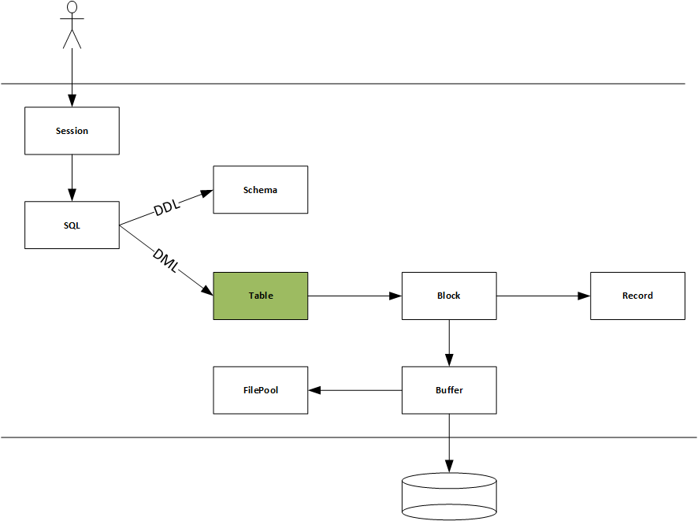

# dbimpl工程

《数据库系统原理与实现》课程实验

## 编译环境

1. cmake

2. visual studio 2019+

## 编译步骤

1. 打开visual studio 2019 x64 native tools command命令终端；

2. 进入db/build目录；

3. cmake ..

4. make

## 修订记录

### [2021.05.30]

完成Block::insertRecord，正在处理Table::insert，需要添加移动记录的方案。打算在Block中添加一个RecordIterator，这个迭代器是数组型的，功能比Table::BlockIterator要强。

### [2021.04.24]

增加buffer管理层，统一管理所有缓冲。缓冲大小为BLOCK_SIZE，由一个BufDesp结构管理，BufDesp内部有一个引用计数，当引用计数大于0，该缓冲出借给用户，不能释放。向上层暴露几个接口：borrow，write，relref。borrow相当与read，write只是标记了DIRTY，relref释放借用的缓冲。

## TODO

1. struct iovec结构应该包含一个类型的指针，这样就可以避免来回的betoh，很烦。

2. 超块的管理有待完善；

3. wal日志；

4. buffer层需要一个协程来刷盘；

## 实验1 聚集存储

在底层实现聚集存储，定义Block、Record等元素，导出记录的增加、删除、更新、枚举接口。

## 实验2 Btree索引

与实验1配合，采用Btree增加对索引的支持，导出查询接口。

## 实验3 Buffer管理

## 实验4 日志

## 实验5 SQL解析

## 实验6 事务并发与恢复

